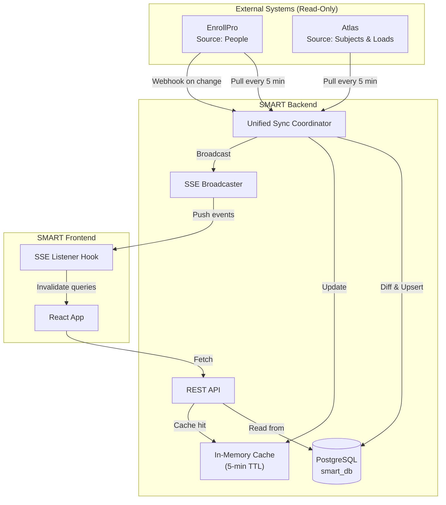

# SMART ↔ EnrollPro & Atlas — Sync Architecture: Diagnosis, Advice & Implementation Plan

## Executive Summary

After a thorough audit of your codebase, I've identified **why your sync is inconsistent and not real-time**, and I'm recommending a consolidated architecture to fix it. The core problems are: **redundant overlapping sync modules**, **no change detection**, **race conditions between schedulers**, and **no frontend reactivity** to sync events. Below is the full diagnosis, advice, and a comprehensive implementation plan.

---

## 1. Current Architecture Audit

### What You Have Now (7 Sync Entry Points!)

Your system currently has **seven different paths** that sync data, which is the root cause of inconsistency:

| # | Module | Trigger | What It Syncs | Schedule |
|---|--------|---------|---------------|----------|
| 1 | `syncService.ts` → `runFullSync()` | Server boot + `setInterval` (5 min) | Teachers + Students + Enrollments + Atlas assignments | Every 5 min |
| 2 | `atlasSync.ts` → `startAtlasSyncScheduler()` | Server boot + `setInterval` | Atlas teaching load only | Every 5 min |
| 3 | `enrollproSync.ts` → `startEnrollProSyncScheduler()` | Server boot + `setInterval` | Sections + Students + Enrollments | Every 5 min (configurable) |
| 4 | `enrollproBrandingSync.ts` | Server boot + `setInterval` | Branding/logo/colors | Every 60 min |
| 5 | `teacherSync.ts` → `syncTeacherOnLogin()` | Teacher login | Per-teacher advisory + students + Atlas load | On-demand |
| 6 | `routes/sync.ts` | Admin manual trigger | Full/partial sync | On-demand |
| 7 | `routes/integration.ts` webhook | EnrollPro webhook | Triggers `runEnrollProSync()` | On-demand |

### Problems Identified

#### Problem 1: Triple-Firing on Boot
When the server starts, **three schedulers fire simultaneously**:
```
index.ts line 82: startAtlasSyncScheduler(5)     → runAtlasSync()
index.ts line 85: startEnrollProSyncScheduler(5) → runEnrollProSync()
index.ts line 89: void autoSync()                → runFullSync() → also calls runAtlasSync()!
```
This means Atlas sync runs **twice on boot** and every 5 minutes you have **three independent timers** all hammering EnrollPro and Atlas APIs.

#### Problem 2: Conflicting Sync Logic
- `syncService.ts` calls `runAtlasSync()` from `atlasSync.ts` — but `atlasSync.ts` has its **own scheduler** that also fires independently.
- `enrollproSync.ts` syncs students/sections **differently** from `syncService.ts` → `syncStudentsFromEnrollProForSchoolYear()`. They use different field mappings and fallback logic.
- `teacherSync.ts` (1005 lines!) duplicates almost everything from the other two, with its own Atlas HTTP helper, its own section upserter, its own grade level mapper.

#### Problem 3: Race Conditions
Each module has its own `syncRunning` boolean lock, but they don't coordinate:
- `runFullSync()` has `syncInProgress`
- `runAtlasSync()` has its own `syncRunning`
- `runEnrollProSync()` has its own `syncRunning`

When `autoSync()` calls `runFullSync()` → `runAtlasSync()`, and independently `startAtlasSyncScheduler()` fires `runAtlasSync()` — the second call sees `syncRunning = true` and **silently skips**. This creates **missed syncs** or **partial syncs**.

#### Problem 4: No Change Detection
Every sync cycle does a **full pull** of all data even if nothing changed. This:
- Wastes bandwidth and time (especially with paginated learners — hundreds of records)
- Creates unnecessary DB writes (upsert still writes if data is identical)
- Makes it impossible to know if data actually changed

#### Problem 5: Frontend Has No Reactivity
- SSE infrastructure exists (`sseManager.ts`) but only `enrollproSync.ts` broadcasts events. `atlasSync.ts` and `syncService.ts` do not.
- Frontend pages don't use SSE — they fetch on mount and never refresh.
- When a teacher logs in and `syncTeacherOnLogin()` completes, the dashboard data is already stale (it was loaded before sync finished).

#### Problem 6: Excessive API Calls Per Teacher Login
`teacherSync.ts` makes **10-15 API calls** per login:
1. `resolveEnrollProSchoolYear()` → 2 calls (integration/v1/school-year + /school-years)
2. `getEnrollProTeachers()` → 1 call
3. `getIntegrationV1Sections()` → 1 call
4. `getAllIntegrationV1SectionLearners()` → 1-5 calls (paginated)
5. `findIntegrationV1FacultyByEmployeeId()` → 1 call
6. Atlas `/faculty` → 1 call
7. Atlas `/faculty-assignments/:id` → 1 call
8. Atlas `/schools/:id/schedules/published/faculty/:id` → 1 call
9. `getEnrollProSections()` + `getEnrollProSectionRoster()` per teaching section → 2-8 calls

This adds **500ms–3s latency per login** and hammers external APIs.

---

## 2. Recommended Architecture

### Strategy: **Scheduled Background Sync + In-Memory Cache + SSE Push**

The right pattern for your scenario (3 systems on a Tailscale VPN, medium data volume, real-time teacher experience) is:



### Core Principles

1. **Single Sync Coordinator** — One module orchestrates all sync. No duplicate schedulers.
2. **In-Memory Cache** — Cache EnrollPro sections, teachers, school year resolution. TTL of 5 min. Avoids redundant API calls.
3. **Change Detection** — Hash incoming data, skip DB writes if unchanged. Log only actual changes.
4. **SSE Push to Frontend** — When sync completes, broadcast to all connected clients. Frontend auto-refreshes affected queries.
5. **Teacher Login = Cache Read** — On teacher login, read from cache (populated by background sync) instead of making 15 API calls.
6. **Webhook Support** — When EnrollPro sends a webhook, trigger an immediate sync cycle.

---

## 3. Proposed Changes

### Phase 1: Consolidate Backend Sync (Critical — Fixes Inconsistency)

---

#### [MODIFY] [index.ts](file:///c:/Users/Sean/Desktop/SMART-CAPSTONE-master/server/src/index.ts)

**Remove the triple-scheduler boot.** Replace with a single unified sync coordinator:

```diff
-import { startAtlasSyncScheduler } from "./lib/atlasSync";
-import { startEnrollProSyncScheduler } from "./lib/enrollproSync";
-import { startEnrollProBrandingSyncScheduler } from "./lib/enrollproBrandingSync";
-import { runFullSync } from "./services/syncService";
+import { startUnifiedSyncScheduler } from "./lib/syncCoordinator";

 // Start server
 app.listen(PORT, () => {
   console.log(`Server running on http://localhost:${PORT}`);
-  const intervalMin = parseInt(process.env.ATLAS_SYNC_INTERVAL_MINUTES ?? '5', 10);
-  startAtlasSyncScheduler(intervalMin);
-  const enrollproIntervalMin = parseInt(process.env.ENROLLPRO_SYNC_INTERVAL_MINUTES ?? '5', 10);
-  startEnrollProSyncScheduler(enrollproIntervalMin);
-  const brandingIntervalMin = parseInt(process.env.ENROLLPRO_BRANDING_SYNC_INTERVAL_MINUTES ?? '60', 10);
-  startEnrollProBrandingSyncScheduler(brandingIntervalMin);
-  void autoSync();
-  setInterval(() => { void autoSync(); }, syncInterval);
+  startUnifiedSyncScheduler();
 });
```

---

#### [NEW] [syncCoordinator.ts](file:///c:/Users/Sean/Desktop/SMART-CAPSTONE-master/server/src/lib/syncCoordinator.ts)

**The single orchestrator.** Responsibilities:
- Runs a 5-minute sync cycle (configurable via `SYNC_INTERVAL_MINUTES`)
- Calls EnrollPro sync first, then Atlas sync, then branding sync (at a lower frequency)
- Maintains a global lock to prevent overlapping runs
- Broadcasts SSE events for start/complete/error
- Exposes `getLastSyncResult()` and `isSyncRunning()` for the status endpoint
- Exposes `triggerImmediateSync()` for webhooks and manual triggers

Key design:
```typescript
// Sync order matters — Atlas depends on sections from EnrollPro
// 1. EnrollPro: Teachers → Sections → Students → Enrollments
// 2. Atlas: Teaching Load (needs sections + teachers from step 1)
// 3. Branding (independent, lower frequency)
```

---

#### [MODIFY] [enrollproSync.ts](file:///c:/Users/Sean/Desktop/SMART-CAPSTONE-master/server/src/lib/enrollproSync.ts)

Remove the `startEnrollProSyncScheduler()` function. The coordinator will call `runEnrollProSync()` directly.

---

#### [MODIFY] [atlasSync.ts](file:///c:/Users/Sean/Desktop/SMART-CAPSTONE-master/server/src/lib/atlasSync.ts)

Remove the `startAtlasSyncScheduler()` function. The coordinator will call `runAtlasSync()` directly.

---

#### [MODIFY] [enrollproBrandingSync.ts](file:///c:/Users/Sean/Desktop/SMART-CAPSTONE-master/server/src/lib/enrollproBrandingSync.ts)

Remove the `startEnrollProBrandingSyncScheduler()` function. The coordinator will call it every Nth cycle.

---

### Phase 2: Add Caching Layer (Fixes Performance)

---

#### [NEW] [syncCache.ts](file:///c:/Users/Sean/Desktop/SMART-CAPSTONE-master/server/src/lib/syncCache.ts)

In-memory cache for frequently accessed external data:

```typescript
// Cache keys:
// - enrollpro:teachers       → EnrollProTeacher[]
// - enrollpro:sections       → sections from integration v1
// - enrollpro:schoolYear     → { id, yearLabel }
// - atlas:faculty            → Atlas faculty list
// - enrollpro:sectionRoster:${sectionId} → learner[]

// TTL: 5 minutes (matches sync interval)
// Invalidated on every sync cycle completion
```

Benefits:
- `teacherSync.ts` reads from cache instead of making 15 API calls
- Webhook-triggered syncs have fresh data immediately
- Cache miss gracefully falls through to live API call

---

#### [MODIFY] [teacherSync.ts](file:///c:/Users/Sean/Desktop/SMART-CAPSTONE-master/server/src/lib/teacherSync.ts)

Refactor to use `syncCache` for all external data reads. Replace:
- `getEnrollProTeachers()` → `syncCache.getTeachers()` (returns cached or fetches)
- `getIntegrationV1Sections()` → `syncCache.getSections()` (returns cached or fetches)
- `atlasGet('/faculty')` → `syncCache.getAtlasFaculty()` (returns cached or fetches)

This should reduce `syncTeacherOnLogin()` from ~15 API calls to **0–3 API calls** (only individual teacher-specific data that can't be cached).

---

### Phase 3: Frontend Reactivity (Fixes "Not Real-Time")

---

#### [NEW] [useSyncStream.ts](file:///c:/Users/Sean/Desktop/SMART-CAPSTONE-master/src/hooks/useSyncStream.ts)

React hook that connects to the SSE stream and triggers React Query invalidation:

```typescript
// Listens to GET /api/integration/sync/stream
// On ENROLLPRO_SYNC_COMPLETE → invalidate ['students', 'sections', 'enrollments', 'advisory']
// On ATLAS_SYNC_COMPLETE → invalidate ['teaching-load', 'class-assignments']
// On SYNC_ERROR → show toast notification
// Auto-reconnects on disconnect with exponential backoff
```

---

#### [MODIFY] Frontend pages that display synced data

Add the `useSyncStream()` hook to key pages:
- `Dashboard.tsx` (teacher) — shows teaching load and advisory
- `MyAdvisory.tsx` — shows advisory students
- `ClassRecordsList.tsx` — shows class assignments
- `ClassAssignments.tsx` (admin) — shows all assignments

When SSE pushes a sync-complete event, these pages auto-refresh without manual reload.

---

### Phase 4: Change Detection (Optimization — Can Be Deferred)

---

#### [MODIFY] [enrollproSync.ts](file:///c:/Users/Sean/Desktop/SMART-CAPSTONE-master/server/src/lib/enrollproSync.ts)

Add a lightweight hash comparison before writing:

```typescript
// Before upserting a student:
const existingHash = existingStudent ? hashFields(existingStudent) : null;
const incomingHash = hashFields(incomingLearner);
if (existingHash === incomingHash) { skipped++; continue; }
// Only upsert if data actually changed
```

This reduces DB writes from ~500 per cycle to only the records that actually changed (typically 0-5 per cycle in steady state).

---

## 4. Advice for Your Specific Questions

### Q: "What's the best method for fetching?"

**Answer: Scheduled polling (pull) with webhook-triggered immediate sync (push).** Here's why:

| Method | Pros | Cons | Verdict |
|--------|------|------|---------|
| **Polling every N min** | Simple, reliable, works even if source systems don't support webhooks | Slight delay (up to N min), wastes calls if nothing changed | ✅ Use as baseline |
| **Webhooks (push)** | Instant updates, no wasted calls | Requires other team to implement webhook sending, unreliable if network drops | ✅ Use as enhancement |
| **WebSocket real-time** | True real-time | Overkill for this use case, complex to maintain, neither EnrollPro nor Atlas offer WebSocket APIs | ❌ Don't use |
| **On-demand (fetch on page load)** | Always fresh | Slow page loads, hammers external APIs, fails if external system is down | ❌ Don't use alone |

**Your ideal setup:**
1. **Background poll every 5 minutes** (catches everything)
2. **Webhook from EnrollPro** for instant student enrollment changes (you already have the endpoint!)
3. **Per-teacher refresh on login** reading from cache (fast, no external calls)
4. **SSE push to frontend** so teachers see updates without refreshing

### Q: "How to make it real-time for teachers?"

The perception of "real-time" doesn't require actual real-time sync. Teachers need:
1. **Fresh data when they open a page** → Background sync every 5 min ensures data is ≤5 min old
2. **Instant update if data changes while they're looking** → SSE push + React Query invalidation
3. **No stale data after login** → Per-teacher sync on login (from cache = instant)

With this architecture, the maximum delay a teacher would experience is **5 minutes** in the worst case, and **instant** when EnrollPro sends a webhook.

### Q: "How to handle EnrollPro as source of truth for login?"

You're already doing this correctly in `auth.ts`:
- Teacher enters employeeId + password
- SMART validates against EnrollPro's `/auth/login`
- If EnrollPro rejects → login fails (fail-closed)
- If EnrollPro is down → login fails with 503

**This is the right approach.** The only improvement is to also check `isActive` status from the cached teacher list (which you're also doing). ✅

---

## 5. Summary of Sync Architecture After Changes

```
┌──────────────────────────────────────────────────────────┐
│                    SMART Server Boot                     │
│                                                          │
│  startUnifiedSyncScheduler()                             │
│    ├─ Immediate: runEnrollProSync() → runAtlasSync()     │
│    ├─ Every 5 min: repeat above                          │
│    └─ Every 60 min: syncBranding()                       │
│                                                          │
│  Webhook POST /api/integration/enrollpro-webhook         │
│    └─ triggerImmediateSync() (same coordinator)          │
│                                                          │
│  Teacher Login                                           │
│    ├─ Validate against EnrollPro /auth/login             │
│    └─ syncTeacherOnLogin() reads from syncCache          │
│       (0 external calls if cache is fresh)               │
│                                                          │
│  SSE → Frontend auto-refreshes on sync-complete          │
└──────────────────────────────────────────────────────────┘
```

> [!IMPORTANT]
> **Phase 1 (Consolidation) is the critical fix.** The current triple-scheduler is actively causing your inconsistency issues. Phases 2-4 are optimizations that improve performance and UX but aren't strictly required for correctness.

---

## Open Questions

> [!IMPORTANT]
> 1. **Do you want me to implement all 4 phases, or start with Phase 1 (consolidation) only?** Phase 1 alone will fix the inconsistency. The others add polish.
> 2. **Is the 5-minute polling interval acceptable?** If teachers need data fresher than 5 min and webhooks aren't reliable, we could go to 2 min — but this increases API load.
> 3. **Does `dev-jegs` (EnrollPro team) actually send webhooks to your `/api/integration/enrollpro-webhook` endpoint?** If not, the webhook code is dead code and we should coordinate with them.
> 4. **Should we keep the `syncService.ts` full-sync as the admin manual trigger, or replace it entirely with the coordinator?** Currently the admin sync route uses `syncService.ts` which has different logic from `enrollproSync.ts`.

## Verification Plan

### Automated Tests
- `npm run build` in `server/` — ensure no TypeScript errors
- Start server, verify single `[SyncCoordinator]` log line on boot (not triple)
- Verify SSE events fire after sync by connecting to `/api/integration/sync/stream` with curl

### Manual Verification
- Admin triggers `POST /api/sync/all` → verify single sync run with correct counts
- Teacher logs in → verify `syncTeacherOnLogin` completes in <500ms (cache hit)
- Change a student name in EnrollPro → verify SMART reflects it within 5 minutes
- Check server logs for no duplicate `[sync]` entries
